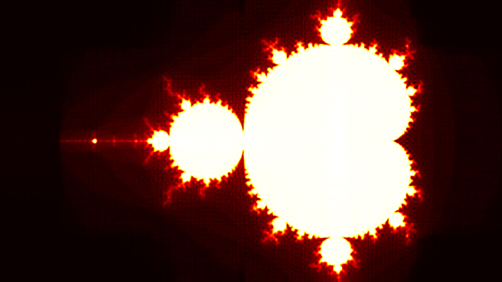

# Mandelbrot Neural Network

ORIGINAL IDEA from https://github.com/MaxRobinsonTheGreat/mandelbrotnn.
I reproduced his experiments with limited ressources. Basically he uses fourier features to approximate the mandelbrot set with a big neural network (~8M parameters). I did it with 600k parameters with a "pseudo-Fourier 2D features", and I'm pretty satisfied with the result.

Training GIF :

Final Approximation (8K resolution) :

# Requirements
- python3
- pip3

# Setup
Install dependencies with:

`pip install -r requirements.txt`

Then run `python main.py` for some example uses. Take a look at the `main.py` file for some example functions on how to use the modules.
